


 

  


<h2 align="center" id="sobre">Sobre</h2>

<table>
<tr>
<td width="50%" valign="middle">

Oi, eu sou a **Leticia**. Trabalho no ponto onde **código** e **design** se encontram: penso a interface, desenho a identidade visual e implemento tudo até funcionar direito.

- 🛠️ **Back-end:** APIs em C# (.NET 8) com arquitetura limpa, testes e documentação legível
- ⚡ **Front-end:** TypeScript, React e Next.js com foco em acessibilidade e performance
- 🎨 **Design:** Figma, Illustrator e Photoshop para marcas, interfaces e design systems
- 🎮 **Criativo:** protótipos 2D em Unity e experimentos 3D no Blender
- ☕ **Combustível:** café, lo-fi e teimosia produtiva

</td>
<td width="50%" valign="middle">


</td>
</tr>
</table>

<h2 align="center" id="stack">Stack</h2>


  

<table>
<tr>
<th align="center">Back-end &amp; Dados</th>
<th align="center">Front-end</th>
<th align="center">Design &amp; Criativo</th>
</tr>
<tr>
<td align="center"></td>
<td align="center"></td>
<td align="center"></td>
</tr>
</table>

<h2 align="center" id="projetos">Projetos</h2>

<table>
<tr>
<td width="50%" align="center"><a href="https://lehtrus.github.io/PixelForge/"></a></td>
<td width="50%" align="center"><a href="https://github.com/lehtrus/Kadence"></a></td>
</tr>
<tr>
<td width="50%" align="center"><a href="https://github.com/lehtrus/Paleta-ia"></a></td>
<td width="50%" align="center"><a href="https://github.com/lehtrus/NeonMoth"></a></td>
</tr>
<tr>
<td width="50%" align="center"><a href="https://github.com/lehtrus/BrandKit-Builder"></a></td>
<td width="50%" align="center"><a href="https://github.com/lehtrus/StudioPulse"></a></td>
</tr>
</table>

<h2 align="center" id="stats">Stats</h2>

  

<table>
<tr>
<th align="center">🔭 Construindo</th>
<th align="center">🌱 Estudando</th>
<th align="center">🤝 Colaborando</th>
<th align="center">💬 Pergunte-me sobre</th>
</tr>
<tr>
<td align="center">Plataforma que junta design e código no mesmo fluxo</td>
<td align="center">Microsserviços com .NET e motion design</td>
<td align="center">Open source de ferramentas para designers</td>
<td align="center">C#, TypeScript, Figma e café</td>
</tr>
</table>

<h2 align="center" id="contato">Contato</h2>

  

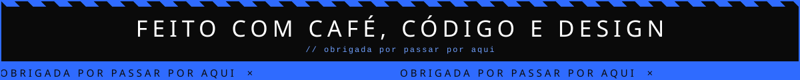

